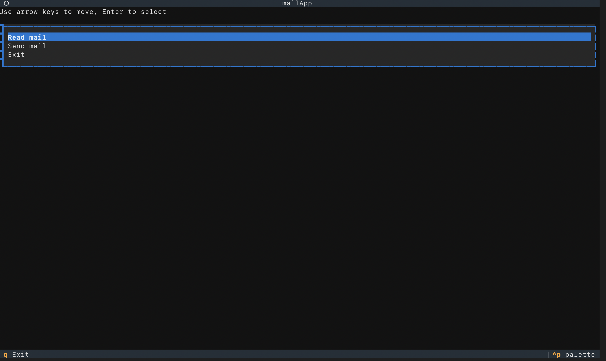
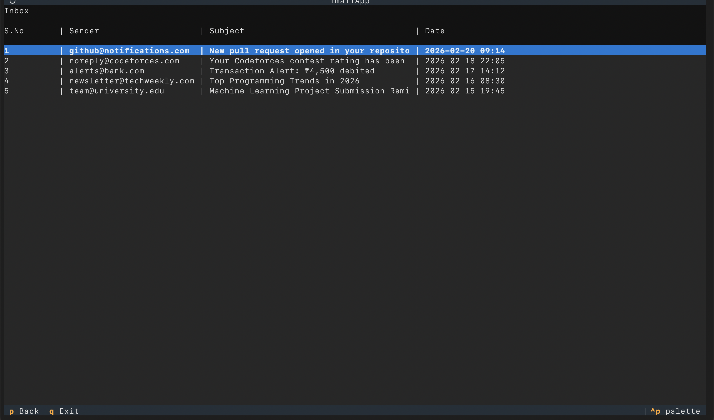
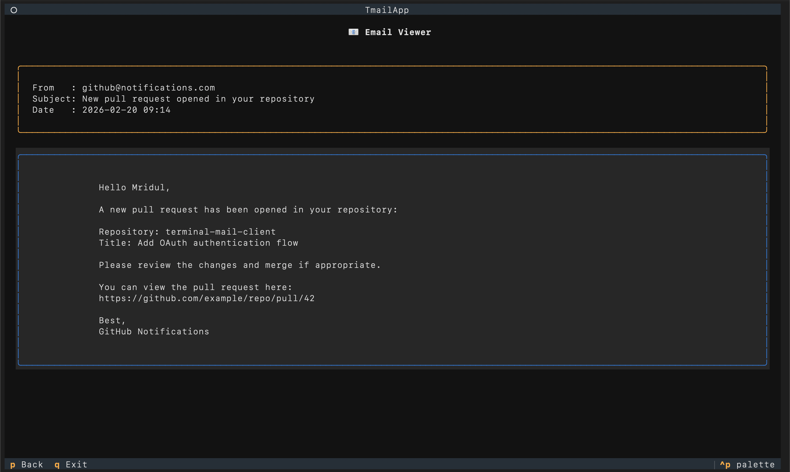
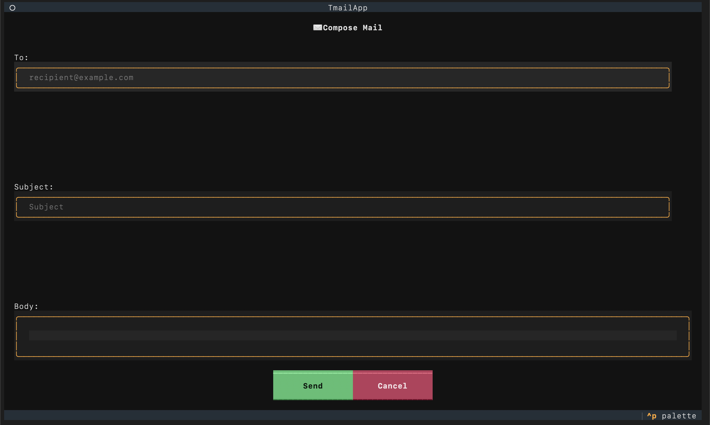

# TMail – Terminal Gmail Client 📧

TMail is a **Terminal User Interface (TUI) Gmail client** built with **Python** using the **Textual framework**. It allows users to **read and send Gmail emails directly from the terminal** through a keyboard-driven interface.

The application integrates with the **Gmail API** using OAuth authentication and provides a simple yet powerful way to manage emails without leaving the terminal.

---

# Features

* 📥 **Read Emails**

  * View inbox messages
  * Browse emails using keyboard navigation
  * Open and read full email content

* ✉️ **Send Emails**

  * Compose and send emails directly from the terminal

* 🧭 **Keyboard Navigation**

  * Arrow keys to move through options
  * Enter to select
  * `p` to go back
  * `q` to quit

* 📜 **Scrollable Email Viewer**

  * Long emails displayed in a scrollable viewer

* 🎨 **Terminal UI**

  * Built with **Textual** and **Rich** for a modern terminal experience

---

# Screenshots

Below are screenshots of the different interfaces of the application.

Note:
For privacy reasons, the Read Mail (Inbox) screenshot uses mock email data instead of real Gmail messages. The actual application fetches emails directly from your Gmail account using the Gmail API after authentication.

---

## Main Menu

This is the first screen shown when launching the application.



*(Paste screenshot of the main menu here)*

---

## Inbox View

Displays the list of emails fetched from Gmail. Users can navigate through emails using the arrow keys.



*(Paste screenshot of the inbox screen here)*

---

## Email Viewer

Shows the full content of a selected email in a scrollable viewer.



*(Paste screenshot of the email viewing screen here)*

---

## Compose Email

Interface used to write and send a new email.



*(Paste screenshot of the email compose screen here)*

---

# Technologies Used

* **Python**
* **Textual** – Terminal UI framework
* **Rich** – Terminal rendering
* **Gmail API**
* **Google OAuth2**

---

# Project Structure

```
tmail/
│
├── app.py
│
├── screens/
│   ├── read_mail.py
│   ├── view_mail.py
│   ├── send_mail.py
│   └── mock_emails.py
│
├── services/
│   ├── authenticate.py
│   ├── read_mail.py
│   └── send_mail.py
│
└── README.md
```

### Description

| File / Folder     | Purpose                                           |
| ----------------- | ------------------------------------------------- |
| `app.py`          | Main entry point of the application               |
| `screens/`        | UI screens for different parts of the application |
| `services/`       | Logic for interacting with the Gmail API          |
| `authenticate.py` | Handles OAuth authentication                      |
| `read_mail.py`    | Fetches emails from Gmail                         |
| `send_mail.py`    | Sends emails using Gmail API                      |

---

# Installation

### 1. Clone the repository

```bash
git clone https://github.com/yourusername/tmail.git
cd tmail
```

---

### 2. Create a virtual environment

```bash
python -m venv venv
source venv/bin/activate
```

Windows:

```bash
venv\Scripts\activate
```

---

### 3. Install dependencies

```bash
pip install textual rich google-api-python-client google-auth google-auth-oauthlib
```

---

# Google Cloud Setup (Gmail API)

To allow the application to access your Gmail account, you must create a **Google Cloud project** and enable the **Gmail API**.

### Step 1 – Create a Google Cloud Project

1. Go to the **Google Cloud Console**
2. Click **Select Project → New Project**
3. Give your project a name
4. Create the project

---

### Step 2 – Enable Gmail API

1. Navigate to **APIs & Services → Library**
2. Search for **Gmail API**
3. Click **Enable**

---

### Step 3 – Create OAuth Client ID

1. Go to **APIs & Services → Credentials**
2. Click **Create Credentials**
3. Select **OAuth Client ID**
4. Choose **Desktop Application**
5. Create the client

---

### Step 4 – Download OAuth Credentials

Download the OAuth credentials file and place it in the project directory.

---

### Step 5 – Run the Application

When the application runs for the first time, a **browser window will open** asking you to log in to your Google account and authorize the application.

---

# Running the Application

Start the application with:

```bash
python app.py
```

You will see a menu similar to:

```
Read Mail
Send Mail
Exit
```

Navigate using the arrow keys and press **Enter** to select an option.

---

# Keyboard Shortcuts

| Key   | Action           |
| ----- | ---------------- |
| ↑ / ↓ | Navigate menu    |
| Enter | Select option    |
| p     | Go back          |
| q     | Quit application |

---

# Example Workflow

1. Launch the application
2. Select **Read Mail**
3. Choose an email from the inbox
4. View the full email content
5. Press `p` to return to the inbox
6. Use **Send Mail** to compose and send a new email

---

# Future Improvements

* Email search functionality
* Delete emails
* Reply and forward support
* Attachments support
* Pagination for large inboxes
* Improved inbox layout
* Multiple email account support

---

# License

This project is intended for **educational and learning purposes**.
